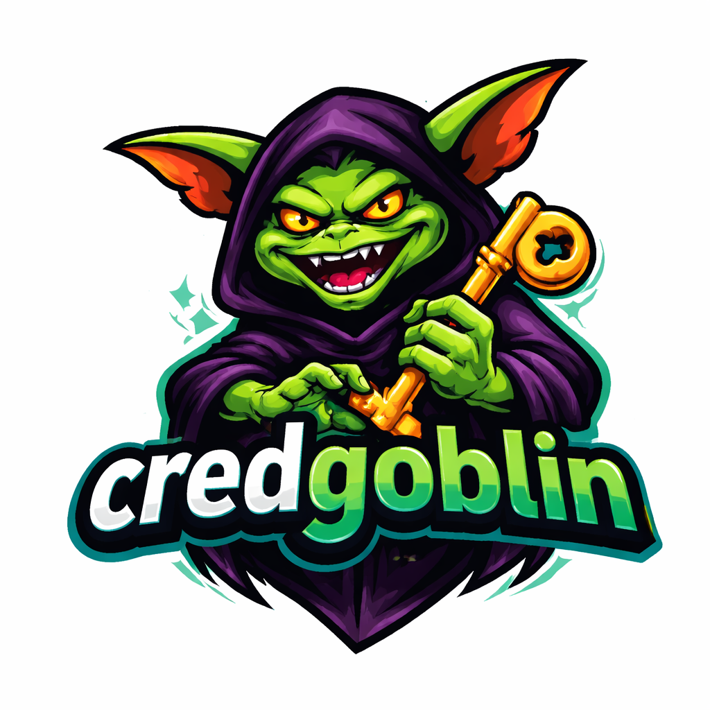

# Credgoblin

<p align="center">
  
</p>

An NTLM hash capture and relay tool written in Go, designed to replicate core functionality of ntlmrelayx and Responder.

## Features

- **NTLM Hash Capture**: Capture NTLMv2 hashes from incoming SMB connections
- **NTLM Relay to LDAP/LDAPS**: Relay captured authentication to LDAP for shadow credentials attacks
- **NTLM Relay to ADCS**: Relay captured authentication to ADCS web enrollment for certificate requests
- **Shadow Credentials Attack**: Automatically add msDS-KeyCredentialLink for certificate-based authentication
- **SMB Server**: Full SMB1/SMB2 server implementation for capturing authentication

## Usage

### Capture Mode
```bash
# Capture NTLM hashes
./credgoblin capture -i <listen-ip>
```

### Relay Mode (LDAP)
```bash
# Relay to LDAP for shadow credentials attack
./credgoblin relay -t ldap://<dc-ip> -u '<target-user-dn>'

# Relay to LDAPS
./credgoblin relay -t ldaps://<dc-ip> -u '<target-user-dn>'
```

### Relay Mode (ADCS)
```bash
# Relay to ADCS web enrollment
./credgoblin relay -m adcs -t http://<ca-server> -T User -o cert.pfx

# Relay to ADCS over HTTPS
./credgoblin relay -m adcs -t https://<ca-server> -T Machine -o cert.pfx -v
```

### Options
- `-i, --interface`: IP address to listen on
- `-t, --target`: Target URL (ldap://, ldaps://, http://, or https://)
- `-m, --mode`: Relay mode: `ldap` or `adcs` (default: ldap)
- `-u, --target-user`: Target user DN for LDAP shadow credentials attack
- `-T, --template`: Certificate template name for ADCS relay (e.g., User, Machine)
- `-o, --output`: Output file for captured hashes or PFX certificate
- `-P, --pfx-pass`: Password for exported PFX certificate
- `-v, --verbose`: Enable verbose/debug output

## Windows Server 2025 - NTLM Relay Hardening

> **⚠️ Important Security Research Finding**

Testing has confirmed that **Windows Server 2025 has effectively killed NTLM relay attacks to LDAP/LDAPS** through enhanced MIC (Message Integrity Check) enforcement.

### What We Tested

| Tool | MIC Stripping | Target | Result |
|------|---------------|--------|--------|
| credgoblin | Yes | LDAP (389) | ❌ FAILED |
| credgoblin | Yes | LDAPS (636) | ❌ FAILED |
| ntlmrelayx `--remove-mic` | Yes | LDAPS (636) | ❌ FAILED |

### Technical Details

**Error observed:**
```
80090308: LdapErr: DSID-0C090703, comment: AcceptSecurityContext error, data 57
```

- **Error 80090308**: `SEC_E_INVALID_TOKEN` - The security token is malformed
- **Data 57**: `ERROR_INVALID_PARAMETER` (0x57 = 87 decimal)

### Why Traditional MIC Bypass Fails on Server 2025

The classic "Drop the MIC" technique (CVE-2019-1040) no longer works:

1. **MIC is validated regardless of negotiation** - Even if signing flags are removed from Type 1, Server 2025 still validates the MIC
2. **NTLMv2 Response integrity is enforced** - The HMAC-MD5 covering the AV_PAIRS (which includes MsvAvFlags with MIC_PRESENT) cannot be tampered with
3. **Catch-22**: You cannot clear the MIC_PRESENT flag without invalidating the response hash

```
NTLMv2 Response Structure:
┌─────────────────────────────────────────────────┐
│ Bytes 0-15:  HMAC-MD5 (computed over bytes 16+) │
│ Bytes 16+:   Blob containing AV_PAIRS           │
│              └─ MsvAvFlags with MIC_PRESENT bit │
└─────────────────────────────────────────────────┘
Modifying AV_PAIRS → HMAC validation fails → Attack blocked
```

### Windows Server 2025 Security Enhancements

Microsoft has implemented "secure by default" configurations:
- **LDAP Channel Binding**: Enabled by default
- **EPA (Extended Protection for Authentication)**: Enabled for AD CS and LDAP
- **MIC Enforcement**: Validated regardless of client negotiation
- **NTLMv1 Removed**: Only NTLMv2 supported (and deprecated)

### Implications for Red Teams

- NTLM relay to LDAP/LDAPS on Server 2025 DCs is **not viable** with current techniques
- Consider alternative attack paths:
  - **Relay to AD CS** - Now supported with `./credgoblin relay -m adcs`
  - Target older DCs (Server 2019/2022) in the environment
  - Use other coercion methods that may have different NTLM message structures
  
### References

- [CVE-2019-1040 - Drop the MIC](https://blog.preempt.com/drop-the-mic)
- [Microsoft NTLM Relay Protections](https://learn.microsoft.com/en-us/windows-server/security/credentials-protection-and-management/configuring-additional-lsa-protection)
- [Windows Server 2025 Security Features](https://learn.microsoft.com/en-us/windows-server/get-started/whats-new-windows-server-2025)

## Building

```bash
go build -o credgoblin ./cmd/credgoblin
```

## Requirements

- Go 1.21+
- Root/Administrator privileges for binding to port 445
